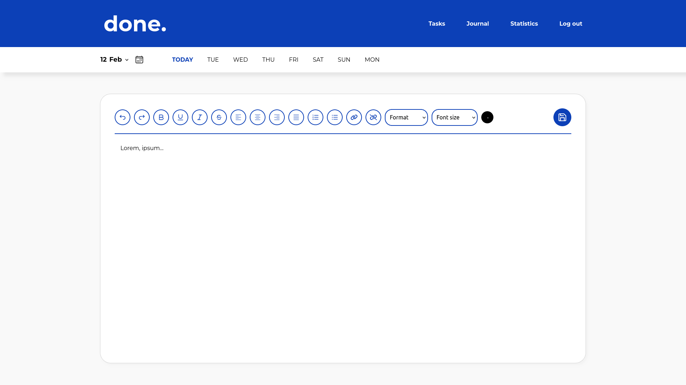

# Done.

**Done** is a to-do list and journal app with numerous features that will be discussed below. The premise of this project is to simplify how we manage personal projects and daily tasks, helping users to get things **done.**

## Screenshots

## Features

- Task starting and due date/time;
- Task repeat;
- Task category;
- Task location;
- Task notes;
- Task share (via email);
- Tasks can be edited after creation;
- Tasks overdue are shown in red;
- Tasks filters;
- Pomodoro timer;
- Journal and text editor;
- Statistics page with charts;
- Downloadable statistics data;
- Working DB with user authentication;
- Responsive;
- Push notifications;

## Tech Stack

**Client:**

- React;
- React-Icons;
- ReCharts;
- Styled-Components;
- React-Dom;
- DOMPurify;
- Axios;
- ExcelJS;

**Server:**

- Node;
- Express;
- Bcrypt;
- Cors;
- Helmet;
- HTTP-Status-Codes;
- JsonWebToken;
- MySQL;
- Web-Push;
- XSS;

## Goal

The primary objective of this project was to develop my skills in full-stack development by creating a feature-rich application that simplifies task management and journaling. Through the implementation of various technologies and features, I aimed to create a robust and user-friendly solution for organizing personal projects and daily tasks, while also gaining hands-on experience with the entire development process from frontend to backend.

This project served as a platform to showcase my proficiency in building modern web applications and to further refine my abilities as a full-stack developer.
